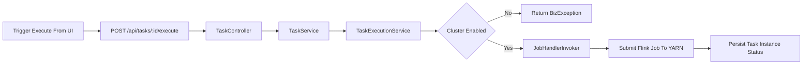

# BigData Management Platform

一个 **大数据任务管理与调度平台**，提供集群管理、任务配置、执行调度、实例追踪与告警能力。

支持 Flink on YARN，架构上预留了更多计算引擎和集群模式的扩展能力。

## ✨ 特性

- 集群管理：支持集群配置新增、查看、启停状态管理
- 任务管理：支持大数据任务新增、编辑、详情查看、执行入口
- 调度能力：基于 Quartz 的任务调度与运行记录
- 实例追踪：任务实例状态跟踪、终止与详情查看
- 告警能力：支持告警策略与告警信息管理，事件驱动通知
- 用户管理：JWT 认证体系，用户启停、密码重置
- 数据看板：首页仪表盘，实时统计与趋势图

## 🧱 技术栈

### Backend

- Java 21
- Spring Boot
- MyBatis-Plus
- Flink 1.17.2
- Quartz
- PostgreSQL

### Frontend

- Vue 3 + TypeScript
- Vite
- Ant Design Vue
- Pinia
- UnoCSS

## 🏗️ 项目结构

```text
bigdata-management/
├── bigdata-server/      # 后端主服务（Web/API）
├── bigdata-api/         # SPI 接口与公共抽象
├── bigdata-flink/       # Flink 引擎集成（支持 YARN / Standalone 等模式）
├── bigdata-scheduler/   # 调度模块（Quartz）
├── bigdata-alert/       # 告警模块（支持多通道扩展，默认钉钉）
├── bigdata-ui/          # 前端工程（Vue3 + Vite）
├── docker/              # Docker 构建文件
└── docs/                # 架构文档
```

## 🔄 核心流程（简化）



## 🚀 快速开始

### 1) 环境要求

- JDK 21+
- Maven 3.9+
- Node.js 18+ / pnpm
- PostgreSQL
- Docker（可选）

### 2) 克隆项目

```bash
git clone https://github.com/smame210/bigdata-management.git
cd bigdata-management
```

### 3) 本地构建

```bash
mvn clean package -DskipTests
```

### 4) 启动后端

```bash
cd bigdata-server
mvn spring-boot:run
```

### 5) 启动前端（开发模式）

```bash
cd bigdata-ui
pnpm install
pnpm dev
```

## 🐳 Docker 部署

镜像仅包含运行时 JAR，构建过程在宿主机完成。

### 1) 构建镜像

```bash
chmod +x scripts/release/build-image.sh
scripts/release/build-image.sh
```

更多参数请查看：`docs/BUILD_IMAGE.md`

### 2) 运行容器

```bash
docker run -d \
  --name bigdata-management \
  -p 8080:8080 \
  -e DS_HOST=your_host:5432 \
  -e DS_USERNAME=your_user \
  -e DS_PASSWORD=your_password \
  bigdata-management:latest
```

| 环境变量 | 说明 | 默认值 |
|---------|------|--------|
| `DS_HOST` | 数据库地址（host:port） | `localhost:5432` |
| `DS_USERNAME` | 数据库用户名 | `postgres` |
| `DS_PASSWORD` | 数据库密码 | `postgres` |
| `USER_DEFAULT_PASSWORD` | 新增用户默认密码 | `Dts@123456` |

## ⚙️ 配置说明

- 后端配置：`bigdata-server/src/main/resources/application.yml`
- 前端环境：`bigdata-ui/.env.*`

> 启动前请先创建 PostgreSQL 数据库，表结构会由应用自动初始化。

## 🧪 常用命令

```bash
# 后端编译（含依赖模块）
mvn -pl bigdata-server -am -DskipTests compile

# 前端 lint
pnpm --dir bigdata-ui exec eslint "src/**/*.{ts,vue}"
```

## 🤝 贡献指南

1. Fork 本仓库并创建特性分支
2. 提交前执行必要的构建与 lint 检查
3. 提交 PR，描述变更背景、实现方案和验证结果

## 📄 License

本项目采用 [Apache License 2.0](LICENSE) 许可协议。
