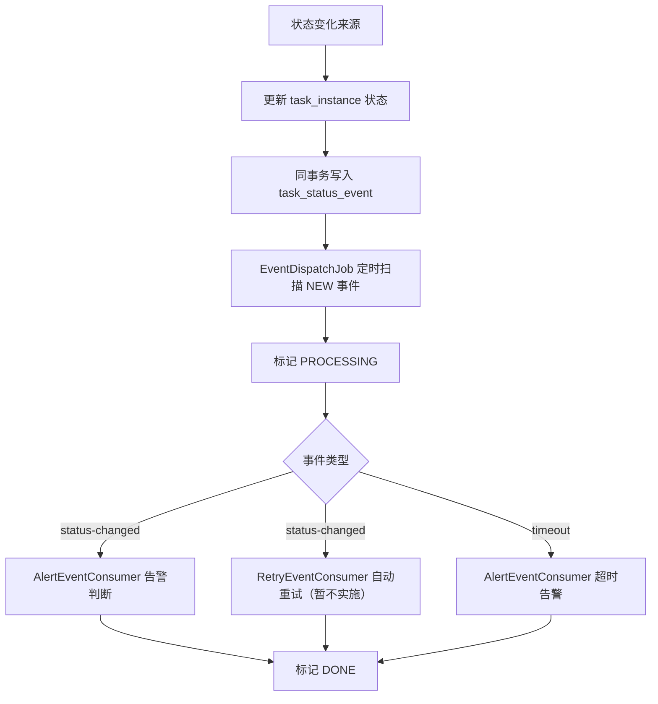

# 基于事件表的任务状态驱动告警方案

> 开发设计文档 · 不引入中间件 · 仅供开发参考

---

## 1. 目标

在**不引入任何中间件**（Kafka / RabbitMQ / Redis Stream 等）的前提下，将“任务状态变化后的告警触发”从**轮询驱动**改为**事件表驱动**，实现：

- 状态变化可持久化
- 应用重启后事件不丢失
- 告警 / 超时等下游逻辑与状态同步解耦

---

## 2. 设计原则

### 2.1 事件落表

所有状态变化来源统一写入一张事件表 `task_status_event`，再由本地消费器按序处理。

### 2.2 同事务保证

状态更新与事件写入放在同一数据库事务中，确保“状态变了但事件丢了”或“事件发了但状态没落库”不会发生。

### 2.3 幂等消费

消费器按 `NEW → PROCESSING → DONE` 推进，确保同一条事件不会被重复处理。

---

## 3. 总体流程



---

## 4. 数据模型

### 4.1 `task_status_event` 表

```sql
CREATE TABLE public.task_status_event (
    id              SERIAL PRIMARY KEY,
    instance_id     INTEGER NOT NULL,
    task_id         INTEGER NOT NULL,
    event_type      VARCHAR(32)  NOT NULL,   -- status-changed / timeout
    old_status      INTEGER,
    new_status      INTEGER,
    source          VARCHAR(32)  NOT NULL,   -- submit / sync / timeout / manual
    payload         JSONB,                   -- 扩展字段
    event_status    VARCHAR(16)  NOT NULL DEFAULT 'NEW',  -- NEW / PROCESSING / DONE / FAILED
    error_msg       TEXT,
    created_at      TIMESTAMP    NOT NULL DEFAULT CURRENT_TIMESTAMP,
    updated_at      TIMESTAMP
);

COMMENT ON TABLE  public.task_status_event IS '任务状态变化事件表';
COMMENT ON COLUMN public.task_status_event.instance_id IS '任务实例 id';
COMMENT ON COLUMN public.task_status_event.task_id     IS '任务 id';
COMMENT ON COLUMN public.task_status_event.event_type  IS '事件类型：status-changed / timeout';
COMMENT ON COLUMN public.task_status_event.source      IS '事件来源：submit / status_sync / timeout_check / manual';
COMMENT ON COLUMN public.task_status_event.event_status IS '事件状态：NEW → PROCESSING → DONE / FAILED';
```

### 4.2 实体（Entity）

```java
public class TaskStatusEvent {
    private Integer id;
    private Integer instanceId;
    private Integer taskId;
    private String  eventType;    // "status-changed" / "timeout"
    private Integer oldStatus;
    private Integer newStatus;
    private String  source;       // "submit" / "sync" / "timeout" / "manual"
    private String  payload;      // JSONB
    private String  eventStatus;  // "NEW" / "PROCESSING" / "DONE" / "FAILED"
    private String  errorMsg;
    private LocalDateTime createdAt;
    private LocalDateTime updatedAt;
}
```

---

## 5. 发布点

任何地方只要修改了 `task_instance.task_status`，就在**同一事务内**写入事件表。

### 5.1 `TaskExecutionServiceImpl.doSubmit()`

提交失败时：

```java
// 1. 写入 FAILED 实例
taskInstanceMapper.insert(instance);

// 2. 同事务写事件
taskStatusEventMapper.insert(new TaskStatusEvent()
    .setInstanceId(instance.getId())
    .setTaskId(taskInfo.getId())
    .setEventType("status-changed")
    .setNewStatus(JobStatusEnum.FAILED.getCode())
    .setSource("submit"));
```

### 5.2 `TaskStatusSyncJob.syncSingleInstance()`

检测到状态变化时：

```java
// 1. 更新 task_instance.task_status
taskInstanceMapper.update(...);

// 2. 同事务写事件
taskStatusEventMapper.insert(new TaskStatusEvent()
    .setInstanceId(instance.getId())
    .setTaskId(taskInfo.getId())
    .setEventType("status-changed")
    .setOldStatus(oldStatus)
    .setNewStatus(currentStatus.getCode())
    .setSource("status_sync"));
```

### 5.3 `TaskTimeoutCheckJob`

检测到超时时：

```java
// 1. 更新超时实例状态
// 2. 同事务写事件
taskStatusEventMapper.insert(new TaskStatusEvent()
    .setInstanceId(instance.getId())
    .setTaskId(instance.getTaskId())
    .setEventType("timeout")
    .setSource("timeout_check"));
```

---

## 6. 消费器

### 6.1 `EventDispatchJob`

定时扫描待处理事件，分发给各监听器：

```java
@Component
@RequiredArgsConstructor
public class EventDispatchJob {

    private final TaskStatusEventMapper eventMapper;
    private final List<EventConsumer> consumers;

    @Scheduled(fixedDelay = 5000)  // 每 5 秒扫一次
    public void dispatch() {
        List<TaskStatusEvent> events = eventMapper.selectList(Wrappers
            .<TaskStatusEvent>lambdaQuery()
            .eq(TaskStatusEvent::getEventStatus, "NEW")
            .last("LIMIT 50"));

        for (TaskStatusEvent event : events) {
            // 原子抢占：NEW → PROCESSING
            int updated = eventMapper.update(Wrappers
                .<TaskStatusEvent>lambdaUpdate()
                .set(TaskStatusEvent::getEventStatus, "PROCESSING")
                .eq(TaskStatusEvent::getId, event.getId())
                .eq(TaskStatusEvent::getEventStatus, "NEW"));
            if (updated != 1) continue;

            try {
                consumers.forEach(c -> c.handle(event));
                eventMapper.updateById(
                    new TaskStatusEvent()
                        .setId(event.getId())
                        .setEventStatus("DONE"));
            } catch (Exception e) {
                eventMapper.updateById(
                    new TaskStatusEvent()
                        .setId(event.getId())
                        .setEventStatus("FAILED")
                        .setErrorMsg(e.getMessage()));
            }
        }
    }
}
```

### 6.2 `EventConsumer` 接口

```java
public interface EventConsumer {
    void handle(TaskStatusEvent event);
}
```

### 6.3 `AlertEventConsumer`

```java
@Component
public class AlertEventConsumer implements EventConsumer {
    private final IAlertTriggerService alertTriggerService;
    private final TaskInstanceMapper taskInstanceMapper;

    @Override
    public void handle(TaskStatusEvent event) {
        if ("status-changed".equals(event.getEventType())) {
            TaskInstance instance = taskInstanceMapper.selectById(event.getInstanceId());
            if (instance == null) return;
            alertTriggerService.onTaskStatusChange(instance,
                JobStatusEnum.getByCode(event.getNewStatus()));
        } else if ("timeout".equals(event.getEventType())) {
            TaskInstance instance = taskInstanceMapper.selectById(event.getInstanceId());
            if (instance == null) return;
            alertTriggerService.onTaskTimeout(instance);
        }
    }
}
```

### 6.4 `RetryEventConsumer`（暂不实施）

> ⚠️ 本节内容为预留设计，当前版本不实施。重试逻辑仍由 `TaskStatusSyncJob` 直接调用 `RetrySchedulerService`。

```java
@Component
public class RetryEventConsumer implements EventConsumer {
    private final RetrySchedulerService retrySchedulerService;
    private final TaskInstanceMapper taskInstanceMapper;

    @Override
    public void handle(TaskStatusEvent event) {
        if ("status-changed".equals(event.getEventType())
                && JobStatusEnum.FAILED.getCode() == event.getNewStatus()) {
            TaskInstance instance = taskInstanceMapper.selectById(event.getInstanceId());
            if (instance == null) return;
            retrySchedulerService.scheduleRetryIfNeeded(instance);
        }
    }
}
```

---

## 7. 可靠性与幂等

### 7.1 事件不丢失

- 状态更新与事件写入在**同一数据库事务**内
- 即使进程崩溃，事件行已落表，重启后会被消费器扫描

### 7.2 不重复消费

- 消费器通过 `NEW → PROCESSING` 的条件更新抢占事件
- 只有更新影响的行数 ≥ 1 才继续处理

### 7.3 事件清理

建议通过定时任务清理超过 N 天的 `DONE` 事件，控制表体积：

```sql
DELETE FROM task_status_event
WHERE event_status = 'DONE'
  AND updated_at < NOW() - INTERVAL '7 days';
```

---

## 8. 改造清单

| 步骤 | 内容 |
|------|------|
| Step 1 | 创建 `task_status_event` 表 |
| Step 2 | 创建 `TaskStatusEvent` 实体 + Mapper |
| Step 3 | 创建 `EventConsumer` 接口 |
| Step 4 | 实现 `EventDispatchJob` |
| Step 5 | 实现 `AlertEventConsumer` |
| Step 6 | 实现 `RetryEventConsumer`（暂不实施） |
| Step 7 | 改造 `TaskExecutionServiceImpl` 发布事件 |
| Step 8 | 改造 `TaskStatusSyncJob` 发布事件（移除直接调用告警） |
| Step 9 | 改造 `TaskTimeoutCheckJob` 发布事件 |
| Step 10 | 增加事件清理定时任务 |

---

## 9. 关键风险

| 风险 | 措施 |
|------|------|
| 同事件重复消费 | `NEW → PROCESSING` 条件更新做原子抢占 |
| 消费器处理慢导致积压 | `LIMIT 50` 分批消费；后续可增加并发 |
| 事件表无限增长 | 定时清理 7 天前的 DONE 事件 |
| 消费失败 | 标记 FAILED 并记录 error_msg，后续可手动置回 NEW 重新消费 |
