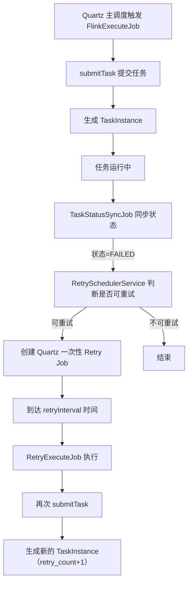

# 调度任务失败自动重试方案

> 开发设计文档 · 不参与代码构建 · 仅供开发参考

---

## 1. 目标

当**调度触发**的任务已经成功提交，但运行一段时间后变成 `FAILED` 时，系统能够根据调度配置自动重新提交任务。

涉及两个配置字段（数据库已有）：

| 字段 | 含义 |
|------|------|
| `max_retry_times` | 最大重试次数 |
| `retry_interval` | 重试间隔（秒） |

---

## 2. 设计原则

### 2.1 职责分离

| 组件 | 职责 |
|------|------|
| `TaskStatusSyncJob` | 只负责同步状态 |
| `RetrySchedulerService` | 只负责编排重试 |
| Quartz Retry Job | 只负责到点后执行重提 |

### 2.2 基于 Quartz 实现延迟

系统已使用 Quartz（clustered JDBC JobStore），"失败后 N 秒重试"本质上是一次性延迟任务，直接交给 Quartz 实现，不另做扫库轮询。

### 2.3 幂等

同一个失败实例只能创建一个 retry Quartz job，避免重复重提。

---

## 3. 整体流程



---

## 4. 各组件职责

### 4.1 `TaskStatusSyncJob`

**现状**：每 30 秒同步一次运行中实例的状态。

**调整后**：仅增加一行——当检测到状态变更为 `FAILED` 时，调用 `RetrySchedulerService.scheduleRetryIfNeeded(instance)`。

它不直接重提，只负责发现失败并通知编排层。

### 4.2 `RetrySchedulerService`（新增）

负责判断失败实例是否满足重试条件：

```java
public void scheduleRetryIfNeeded(TaskInstance instance) {
    // 1. 只有调度触发的任务才重试
    if (instance.getScheduleId() == null) return;

    // 2. 只对 FAILED 重试
    if (instance.getTaskStatus() != FAILED) return;

    // 3. 查调度配置
    TaskSchedule schedule = taskScheduleMapper.selectById(instance.getScheduleId());
    if (schedule == null || schedule.getMaxRetryTimes() <= 0) return;

    // 4. 是否已超重试上限
    if (instance.getRetryCount() >= schedule.getMaxRetryTimes()) return;

    // 5. 是否已安排过重试
    if (Boolean.TRUE.equals(instance.getRetryScheduled())) return;

    // 6. 创建 Quartz 一次性延迟任务
    Date retryTime = DateUtil.offsetSecond(new Date(), schedule.getRetryInterval());
    quartzRetryService.createOneShotRetryJob(instance, retryTime);

    // 7. 标记已调度
    instance.setRetryScheduled(true);
    taskInstanceMapper.updateById(instance);
}
```

### 4.3 `RetryExecuteJob`（新增 Quartz Job）

到点后执行：

```java
protected void executeInternal(JobExecutionContext context) {
    Integer taskId = context.getMergedJobDataMap().getInteger("taskId");
    Integer scheduleId = context.getMergedJobDataMap().getInteger("scheduleId");

    TaskSchedule schedule = taskScheduleMapper.selectById(scheduleId);
    if (schedule == null || schedule.getScheduleStatus() == DISABLE) return;

    taskExecutionService.submitTask(taskId, schedule);
}
```

### 4.4 Quartz 一次性调度封装

项目已有 `AbstractSchedulerProvider` / `CronScheduler` / `ImmediateScheduler`。  
建议扩展 `ImmediateScheduler` 或新增 `DelayedScheduler`：

```java
provider.createDelayedJob(SchedulerCreateParam.builder()
    .name("retry-task-" + instanceId + "-" + retryCount)
    .startAt(retryTime)
    .jobClass(RetryExecuteJob.class)
    .jobData(Map.of("taskId", taskId, "scheduleId", scheduleId))
    .build());
```

---

## 5. 数据模型变更

### 5.1 `task_instance` 表增加字段

| 字段 | 类型 | 说明 |
|------|------|------|
| `retry_count` | int | 当前实例是第几次执行（首次为 0） |
| `root_instance_id` | int | 重试链路的根实例 id |
| `parent_instance_id` | int | 上一次失败实例 id（可追踪链路） |
| `retry_scheduled` | tinyint(1) | 是否已为本次失败创建过 retry job |

### 5.2 实例链示意

```
首次调度执行 → 实例 A: retry_count=0, root_id=A.id, parent_id=null
   ↓ FAILED
重试第 1 次 → 实例 B: retry_count=1, root_id=A.id, parent_id=A.id
   ↓ FAILED
重试第 2 次 → 实例 C: retry_count=2, root_id=A.id, parent_id=B.id
```

---

## 6. 重试判定规则

### 允许重试
- `scheduleId != null`（调度触发）
- 当前状态为 `FAILED`
- 未超过 `maxRetryTimes`
- `retryScheduled = false`
- 调度仍处于启用状态

### 不允许重试
- 手动"立即执行"的实例
- 状态为 `KILLED`
- 状态为 `FINISHED`
- 调度已被禁用
- 已存在同链路未完成的 retry job

---

## 7. 需要留意的风险

### 7.1 重复调度

`TaskStatusSyncJob` 每 30 秒扫描一次。如果某实例一直 FAILED，可能重复创建 retry job。  
**措施**：必须依赖 `retryScheduled` 字段做幂等控制；或在 Quartz job 创建前加唯一约束检查。

### 7.2 调度禁用时清理 retry job

如果用户禁用了 schedule，需要把该调度所有尚未执行的 retry Quartz jobs 一并删除。  
**措施**：在 `ScheduleServiceImpl.updateScheduleStatus(...disable...)` 中增加清理逻辑。

### 7.3 服务重启恢复

项目 Quartz 配置了 clustered JDBC JobStore，retry jobs 会持久化到数据库，应用重启后可自动恢复，无需额外处理。

---

## 8. 落地步骤建议

### Step 1：补表字段
给 `task_instance` 增加 `retry_count`、`root_instance_id`、`parent_instance_id`、`retry_scheduled`。

### Step 2：新增编排层
- `RetrySchedulerService`：编排重试逻辑
- `RetryExecuteJob`：Quartz 重试 job
- 扩展 scheduler provider 支持一次性延迟调度

### Step 3：接入状态同步
在 `TaskStatusSyncJob` 中检测 FAILED 后调用 `retrySchedulerService.scheduleRetryIfNeeded(instance)`。

### Step 4：禁用调度时清理
在 `ScheduleServiceImpl.updateScheduleStatus(status=DISABLE)` 时删除未执行的 retry jobs。

---

## 9. 不推荐的方案

| 方案 | 不推荐原因 |
|------|-----------|
| 在 `TaskStatusSyncJob` 里直接 `submitTask` | 职责耦合、无法精确延迟 |
| 单独做一个固定周期扫库的 `TaskRetryJob` | 延迟不精确，既然已有 Quartz 就不应再造一套简易调度 |
| 在 `FlinkExecuteJob` 里循环 retry | 只能处理提交瞬间失败，管不了运行一段时间后的失败 |
| 在 `doSubmit()` catch 块里 sleep 重试 | 阻塞线程、无法精确延迟、不好管理 |
