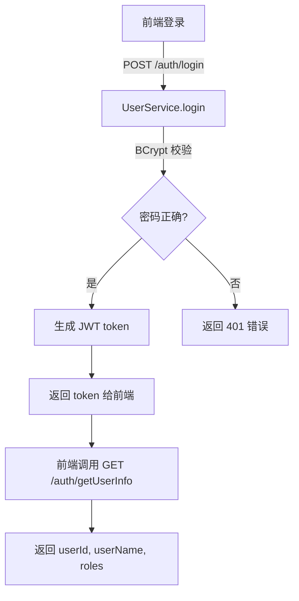
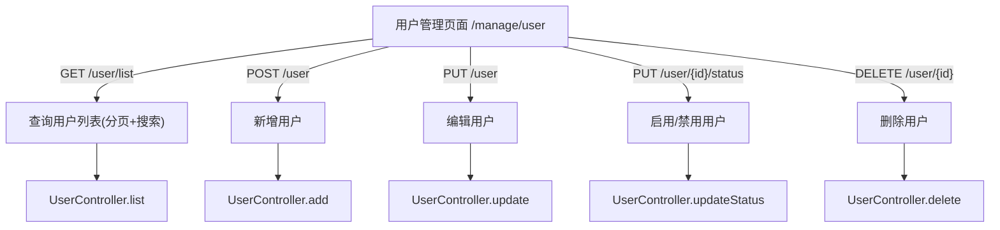

# 用户管理方案

> 开发设计文档 · 不参与代码构建 · 仅供开发参考

---

## 1. 目标

补齐后台用户管理能力，实现**真实的用户注册/登录/CRUD**，并将前端现有用户管理页面从 mock 数据切换到真实 API。

### 1.1 当前状态

| 层 | 现状 |
|----|------|
| **前端** | 用户列表、搜索、新增/编辑抽屉、角色/菜单管理页面均已实现，但调用的是 mock API（Apifox） |
| **后端** | 只有 `/auth/login` 和 `/auth/getUserInfo` 两个假接口——登录返回随机 UUID token，不校验用户名密码；`getUserInfo` 返回硬编码 `userName=Soybean, roles=["R_SUPER"]` |
| **数据库** | 无 `user` 表、无 `role` 表，无密码加密，无真实鉴权 |

### 1.2 本章范围

本次实现限于 **Phase 1**：

- 用户表 + 实体 + 基础 CRUD API
- 登录接口改为真实校验（bcrypt 密码）
- 前端用户管理页面接入真实 API
- 用户状态启用/禁用

后续 Phase 2 再做角色表、权限控制、菜单授权等 RBAC。

---

## 2. 设计原则

### 2.1 渐进增强

不改动前端页面结构和路由，只替换 API 调用。前端已有完整的用户管理 UI（列表、搜索、新增/编辑、状态切换），本节目标是把 mock 换成真实后端。

### 2.2 最小侵入

- 不引入 Spring Security（当前项目没有，也不需要为单表单 CRUD 引入）
- **引入 JWT**（`jjwt-api` / `jjwt-impl` / `jjwt-jackson`），替换现有随机 UUID token，实现无状态认证
- 沿用现有 MyBatis-Plus / Spring Boot 技术栈

### 2.3 密码安全

- 存储使用 **BCrypt** 加密（`spring-security-crypto` 已随 Spring Boot 引入，无需额外依赖）
- 登录时 `BCryptPasswordEncoder.matches(raw, encoded)` 比对
- 创建/重置密码时 `encode(raw)` 存入

---

## 3. 数据模型

### 3.1 `user` 表

```sql
CREATE TABLE public."user" (
    id              SERIAL PRIMARY KEY,
    user_name       VARCHAR(64)  NOT NULL UNIQUE,
    password        VARCHAR(256) NOT NULL,
    nick_name       VARCHAR(64),
    gender          SMALLINT     DEFAULT 0,       -- 0:未知 1:男 2:女
    phone           VARCHAR(20),
    email           VARCHAR(128),
    avatar          VARCHAR(256),
    status          SMALLINT     NOT NULL DEFAULT 1,  -- 1:启用 2:禁用
    create_time     TIMESTAMP    NOT NULL DEFAULT CURRENT_TIMESTAMP,
    update_time     TIMESTAMP
);

COMMENT ON TABLE  public."user" IS '系统用户表';
COMMENT ON COLUMN public."user".user_name IS '用户名（登录账号）';
COMMENT ON COLUMN public."user".password  IS '密码（bcrypt）';
COMMENT ON COLUMN public."user".nick_name IS '昵称';
COMMENT ON COLUMN public."user".gender    IS '性别：0-未知 1-男 2-女';
COMMENT ON COLUMN public."user".phone     IS '手机号';
COMMENT ON COLUMN public."user".email     IS '邮箱';
COMMENT ON COLUMN public."user".avatar    IS '头像URL';
COMMENT ON COLUMN public."user".status    IS '状态：1-启用 2-禁用';

CREATE UNIQUE INDEX idx_user_user_name ON public."user"(user_name);
```

### 3.2 实体（Entity）

```java
package org.bigdata.server.bean.entity;

@Data
@TableName("\"user\"")
public class User {
    private Integer   id;
    private String    userName;
    private String    password;       // bcrypt 加密
    private String    nickName;
    private Integer   gender;         // 0:未知 1:男 2:女
    private String    phone;
    private String    email;
    private String    avatar;
    private Integer   status;         // 1:启用 2:禁用
    private Timestamp createTime;
    private Timestamp updateTime;
}
```

### 3.3 状态枚举

```java
public enum UserStatusEnum {
    ENABLED(1,  "启用"),
    DISABLED(2, "禁用");

    public static UserStatusEnum fromCode(int code) { ... }
}
```

---

## 4. 总体流程

### 4.1 登录流程



### 4.2 用户管理 CRUD



---

## 5. API 设计

### 5.1 认证（已有，需改造）

| 方法 | 路径 | 说明 | 变更 |
|------|------|------|------|
| `POST` | `/auth/login` | 登录 | **改造**：真正校验用户名密码，不再返回随机 token |
| `GET` | `/auth/getUserInfo` | 获取当前用户信息 | **改造**：从 token 查 userId，从 DB 返回真实用户信息 |
| `POST` | `/auth/refreshToken` | 刷新 token | **新增**：前端已有调用，后端目前缺失 |

### 5.2 用户管理（新增）

| 方法 | 路径 | 说明 |
|------|------|------|
| `GET` | `/user/list` | 分页查询用户列表（支持搜索） |
| `GET` | `/user/{id}` | 查询单个用户 |
| `POST` | `/user` | 新增用户 |
| `PUT` | `/user` | 编辑用户 |
| `PUT` | `/user/{id}/status` | 启用/禁用用户 |
| `DELETE` | `/user/{id}` | 删除用户 |

### 5.3 请求/响应体

#### 用户列表查询 `GET /user/list`

```
Request:  { current, size, userName?, gender?, nickName?, phone?, email?, status? }
Response: { code, data: { records: [UserVO], total } }
```

#### 新增用户 `POST /user`

```json
{
  "userName": "zhangsan",
  "password": "abc123",
  "nickName": "张三",
  "gender": 1,
  "phone": "13800138000",
  "email": "zhangsan@example.com",
  "status": 1
}
```

#### 编辑用户 `PUT /user`（password 不传则不修改）

```json
{
  "id": 1,
  "nickName": "张三三",
  "phone": "13900139000",
  "email": "zs@example.com",
  "status": 1
}
```

#### 用户 VO 返回体

```json
{
  "id": 1,
  "userName": "zhangsan",
  "nickName": "张三",
  "gender": 1,
  "phone": "13800138000",
  "email": "zhangsan@example.com",
  "status": 1,
  "createTime": "2026-06-13T12:00:00"
}
```

> **注意**：VO 不返回 `password` 字段。

---

## 6. 后端实现要点

### 6.1 JWT 认证

采用**无状态 JWT**，token 自包含 userId 和过期时间，服务端无需存储。

#### 依赖

```xml
<!-- bigdata-server/pom.xml -->
<dependency>
    <groupId>io.jsonwebtoken</groupId>
    <artifactId>jjwt-api</artifactId>
    <version>0.12.6</version>
</dependency>
<dependency>
    <groupId>io.jsonwebtoken</groupId>
    <artifactId>jjwt-impl</artifactId>
    <version>0.12.6</version>
    <scope>runtime</scope>
</dependency>
<dependency>
    <groupId>io.jsonwebtoken</groupId>
    <artifactId>jjwt-jackson</artifactId>
    <version>0.12.6</version>
    <scope>runtime</scope>
</dependency>
```

#### Token 生成与解析

```java
public class JwtUtil {
    private static final SecretKey KEY = Jwts.SIG.HS256.key().build();
    private static final long EXPIRE_HOURS = 24;

    // 登录成功时生成 token
    public static String generateToken(Integer userId) {
        return Jwts.builder()
            .subject(String.valueOf(userId))
            .issuedAt(new Date())
            .expiration(new Date(System.currentTimeMillis() + EXPIRE_HOURS * 3600 * 1000))
            .signWith(KEY)
            .compact();
    }

    // 每次请求时从 token 中解析 userId
    public static Integer parseUserId(String token) {
        return Integer.parseInt(Jwts.parser()
            .verifyWith(KEY)
            .build()
            .parseSignedClaims(token)
            .getPayload()
            .getSubject());
    }
}
```

#### 请求拦截器

新增 `AuthInterceptor`，在请求进入 Controller 前校验 JWT，解析 userId，**并确认用户存在且为启用状态**：

```java
public class AuthInterceptor implements HandlerInterceptor {

    @Autowired
    private UserMapper userMapper;

    @Override
    public boolean preHandle(HttpServletRequest req, HttpServletResponse resp, Object handler) {
        String token = req.getHeader("Authorization");
        if (token == null || !token.startsWith("Bearer ")) {
            resp.setStatus(401);
            return false;
        }
        try {
            Integer userId = JwtUtil.parseUserId(token.substring(7));

            // 确认用户存在且未被禁用
            User user = userMapper.selectById(userId);
            if (user == null || user.getStatus() != 1) {
                resp.setStatus(401);
                return false;
            }

            AuthContext.setCurrentUserId(userId);
            return true;
        } catch (JwtException e) {
            resp.setStatus(401);
            return false;
        }
    }
}
```

> 这里 `userMapper.selectById(userId)` 按主键查询，走索引，每次请求单行读取，开销极小。如果后续吞吐量上去，可以通过本地缓存（Caffeine）缓存放行状态，但当前阶段直接查库即可。

配置拦截器放行 `/auth/login`，其余请求拦截。

### 6.2 密码处理

```java
// 依赖：org.springframework.security:spring-security-crypto（Spring Boot 已自带）
private final BCryptPasswordEncoder encoder = new BCryptPasswordEncoder();

// 创建/修改密码
String encoded = encoder.encode(rawPassword);

// 登录校验
boolean matched = encoder.matches(rawPassword, user.getPassword());
```

### 6.3 Controller / Service / Mapper

```
bigdata-server/src/main/java/org/bigdata/server/
├── bean/
│   ├── entity/User.java                     (新增)
│   ├── dto/user/
│   │   ├── UserLoginDTO.java                (已有，可能需要扩展)
│   │   ├── UserQueryDTO.java                (新增)
│   │   └── UserSaveDTO.java                 (新增)
│   └── vo/
│       ├── UserLoginVO.java                 (已有，可能需要扩展)
│       ├── UserInfoVO.java                  (已有)
│       └── UserVO.java                      (新增)
├── mapper/
│   ├── UserMapper.java                      (新增)
│   └── (resources/mapper/)
│       └── UserMapper.xml                   (新增)
├── service/
│   ├── IUserService.java                    (已有，需扩展)
│   └── impl/
│       └── UserServiceImpl.java             (已有，需改造)
└── controller/
    ├── UserController.java                  (已有 /auth，需扩展 /user)
    └── UserManageController.java            (新增，独立管理 CRUD)
```

### 6.4 初始化数据

系统需要一个默认管理员账号，在 `init_postgresql.sql` 中插入：

```sql
INSERT INTO public."user" (user_name, password, nick_name, status)
VALUES ('admin', '$2a$10$...', '管理员', 1);
```

BCrypt 密文通过代码生成后写入 SQL。

---

## 7. 前端适配要点

### 7.1 改造范围

| 文件 | 动作 |
|------|------|
| `src/service/api/system-manage.ts` | `fetchGetUserList` 等函数已定义，**无需改动**（URL 已指向正确路径） |
| `src/views/manage/user/index.vue` | 当前调用 `fetchGetUserList` + mock 数据回退，**改造**：移除 mock 回退 |
| `src/views/manage/user/modules/user-operate-drawer.vue` | 当前提交只 toast 不调 API，**改造**：接入新增/编辑 API |
| `src/views/manage/user/modules/user-search.vue` | 搜索表单已定义字段，**无需改动** |
| `src/store/modules/auth/index.ts` | 登录逻辑已通，**改造**：登录失败时提示真实错误信息 |
| `src/views/_builtin/login/modules/pwd-login.vue` | 登录表单已通，**无需改动** |

### 7.2 前端类型对齐

`api.d.ts` 中 `SystemManage.User` 类型目前没有 `id` 字段（使用 `CommonRecord` 泛型）。实际返回的 `id` 字段需要确认是否被 `CommonRecord` 包含。若不一致，需要微调类型定义。

---

## 8. 路由和菜单

当前用户管理路由：

```
/manage/user                  hideInMenu: true, roles: ['R_ADMIN']
```

**本次暂不开启菜单可见**。因为缺少真实角色表，`R_ADMIN`/`R_SUPER` 仍是前端写死的静态角色。Phase 2 实现 RBAC 后再打开菜单入口。

开发者暂通过直接输入 URL `/manage/user` 访问。

---

## 9. 测试要点

| 场景 | 验证 |
|------|------|
| 登录成功 | 正确的用户名/密码 → 返回 token，跳转首页 |
| 登录失败 | 错误的密码/不存在的用户名 → 返回 401，前端提示 |
| 用户列表 | 访问 `/manage/user` → 显示分页用户列表 |
| 新增用户 | 填写表单 → 提交 → 列表中显示新用户 |
| 编辑用户 | 修改昵称/手机/邮箱 → 保存 → 刷新列表看到变更 |
| 禁用/启用 | 切换状态 → 被禁用的用户无法登录 |
| 密码修改 | 编辑时修改密码 → 新密码可登录 |

---

## 10. 后续规划（Phase 2）

| 模块 | 内容 |
|------|------|
| **角色表** | `role` 表 + 实体 + CRUD API |
| **用户-角色关联** | `user_role` 多对多关联表 |
| **真实鉴权** | 请求拦截器校验 token、角色、权限 |
| **菜单授权** | 根据角色动态控制前端路由/菜单可见性 |
| **操作日志** | 用户管理操作记录 |

---

> 设计文档版本：v1.0 · 2026-06-13
